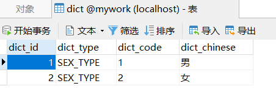

# 字典翻译工具类

## 背景

在我们开发的时候，会有可能遇到将一些代码值转译成中文的场景，库表中会存在一个字典表，记录着对应的代码值和中文翻译，如下图（该表的表名为dict）：




而我们的用户表（举例），设计如下（表名为sys_user）：


sys_user表中，设计有一列为sex（性别），这一列保存的是是1或2的值，而这个值对应的是dict表中的SEX_TYPE类型的字典数据，dict表中描述了代码值对应的中文翻译

而我们在后端代码查询到对应的用户信息返回给前端的时候，需要对sex这个字段进行翻译，即将代码值（1或2）翻译成对应的中文，如下图所示：


库表中保存的sex的值是1或2，但是返回前端的数据中，sex的值是中文的翻译

## 使用说明

### 引入maven依赖

 <dependency>
        <groupId>org.kakahu.dict</groupId>
        <artifactId>util</artifactId>
        <version>1.0-SNAPSHOT</version>
 </dependency>
```

### 代码修改

在**controller**类的方法上声明`@DictSensible`注解即可


#### `@DictSensible` 注解说明

具体代码请自行翻看源码

| 字段名           | 含义                                       | 是否必须                     |
| ---------------- | ------------------------------------------ | ---------------------------- |
| codeValues       | 对应实体类中需要翻译的列名                 | 是                           |
| codeFileName     | 字典表中代码值的列名                       | 是                           |
| tableName        | 字典表的表名                               | 是                           |
| chineseFieldName | 字典表的中文翻译字段名称                   | 是                           |
| typeFieldName    | 字典表中的字典类型字段名称                 | 否                           |
| typeValue        | 字典类型的值                               | 如果有typeFieldName，则必须  |
| statusFileName   | 字典表中的字典状态字段名称                 | 否                           |
| statusValue      | 字典表中状态的值                           | 如果有statusFileName，则必须 |
| toField          | 翻译后放在实体类的字段，为空则放在代码字段（放代码字段时需保证翻译前后的值类型一致） | 否                           |

#### 自定义翻译说明

目前版本保留了`DictCustomConfig`接口，该接口中定义了三个方法（具体代码请自行翻看源码）

| 方法名            | 入参                     | 返回值                  | 说明                                                         |
| ----------------- | ------------------------ | ----------------------- | ------------------------------------------------------------ |
| initDictConfig    | DictSensiblesBean.classs | DictSensiblesBean.class | 对于一些统一的注解配置，可以在这里做统一设置，如tableName、chineseFieldName，但如果在注解上也设置了相同的属性，注解的设置优先 |
| getLableInChinese | DictSensiblesBean.class  | String.class            | 自定义翻译，这里会传入一个DictSensiblesBean.class，包含initDictConfig方法中设置的值和注解上设置的值，可自定义进行翻译。如果不想自定义翻译，该工具会自动翻译。自定义翻译的优先级高于自动翻译，如果实现了自定义翻译，将不会进行自动翻译。**推荐使用自定义翻译** |
| getData           | Object.class             | List.class              | 这里会传入返回的对象，目前自动解析`com.baomidou.mybatisplus.core.metadata.IPage`和`com.baomidou.mybatisplus.extension.api.R`两种类型的返回对象，对于其他类型的返回对象，需要自己在这个方法进行解析，获取到需要翻译的List |

#### DictSensiblesBean.class说明

| 字段名           | 含义                                       |
| ---------------- | ------------------------------------------ |
| codeValues       | 对应实体类中需要翻译的列名                 |
| codeFileName     | 字典表中代码值的列名                       |
| tableName        | 字典表的表名                               |
| chineseFieldName | 字典表的中文翻译字段名称                   |
| typeFieldName    | 字典表中的字典类型字段名称                 |
| typeValue        | 字典类型的值                               |
| statusFileName   | 字典表中的字典状态字段名称                 |
| statusValue      | 字典表中状态的值                           |
| toField          | 翻译后放在实体类的字段，为空则放在代码字段 |

#### 实现`DictCustomConfig`的demo

```java
@Configuration
public class DictConfig implements DictCustomConfig {

    @Override
    public DictSensiblesBean initDictConfig(DictSensiblesBean dict) {
        return  dict.tableName("dict").chineseFieldName("dict_chinese").typeFieldName("dict_type");
    }

    @Override
    public String getLableInChinese(DictSensiblesBean dict) {
        //自行翻译，如不需要自定义翻译，请直接返回null
        return null;
    }

    @Override
    public List<Object> getData(Object o) {
       	Map map = (Map) o;
        return (List<Object>) map.get("data");
    }
}
```

**注意：**实现`DictCustomConfig`接口的类必须要使用`@Configuration`注解修饰
特别鸣谢https://github.com/simple-mine/util
